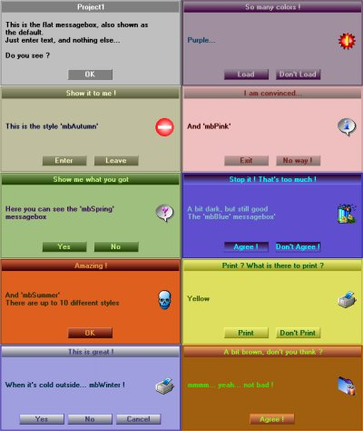



## Advanced messagebox

### Description

A new (advanced) messagebox, with 10 different styles and 1 to 3 buttons. All input is numerated, so it's easy when you code. See the pic for the styles. The syntax is: MBox "Prompt", [Style], [Buttons], [Icon], ["Title"]. For example: MsBox "Prompt" or more complete: MsBox "Prompt", mbWinter, mbSaveDontSave, mbSave, "Title".

The prompt is required, all the rest is optional.

Remember: The form and the module go together ! The return-value = mbReturn. If mbReturn = 0, then the first button has been pressed. If mbReturn = 1 then the second button has been pressed. If mbReturn = 2 then the third button has been pressed.
 
### More Info
 
mbReturn (0 till 2)

             |
---                |---
**Submitted On**   |2000-08-19 02:26:20
**By**             |[stephane swertvaegher](https://github.com/Planet-Source-Code/PSCIndex/blob/master/ByAuthor/stephane-swertvaegher.md)
**Level**          |Advanced
**User Rating**    |4.3 (130 globes from 30 users)
**Compatibility**  |VB 6\.0
**Category**       |[Complete Applications](https://github.com/Planet-Source-Code/PSCIndex/blob/master/ByCategory/complete-applications__1-27.md)
**World**          |[Visual Basic](https://github.com/Planet-Source-Code/PSCIndex/blob/master/ByWorld/visual-basic.md)
**Archive File**   |[CODE\_UPLOAD91038182000\.zip](https://github.com/Planet-Source-Code/stephane-swertvaegher-advanced-messagebox__1-10805/archive/master.zip)

